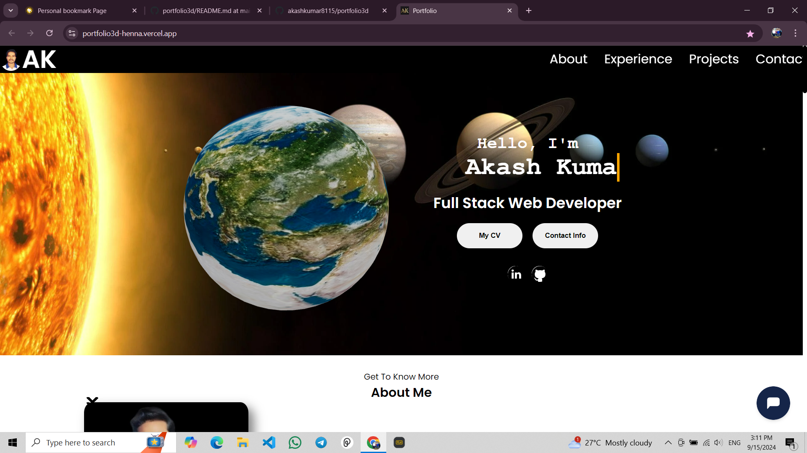

# 🚀 My Portfolio Website

Welcome to my portfolio website! Here you'll find a showcase of my work, skills, and projects. This website is designed to give you an insight into my capabilities as a web developer and to highlight some of the exciting projects I've worked on.


[

## 📌 Features

- **Stunning Design**: A modern and visually appealing design to showcase my work.
- **Responsive Layout**: Optimized for various devices, ensuring a smooth experience on desktops, tablets, and mobiles.
- **Interactive Elements**: Engaging animations and interactions to enhance user experience.
- **Detailed Project Pages**: In-depth information about each project I've worked on, including technologies used and challenges faced.
- **Contact Form**: Easy way for potential clients or collaborators to get in touch with me.

## 🛠 Technologies Used

- **Frontend**: React.js, CSS, HTML
- **Backend**: Node.js, Express (if applicable)
- **Database**: MongoDB (if applicable)
- **Tools & Libraries**: Vite, Axios, CodeMirror (if applicable)

## 📁 Getting Started

To view and use this portfolio locally, follow these steps:

1. **Clone the Repository**
   ```bash
   git clone https://github.com/akashkumar8115/portfolio3d.git

